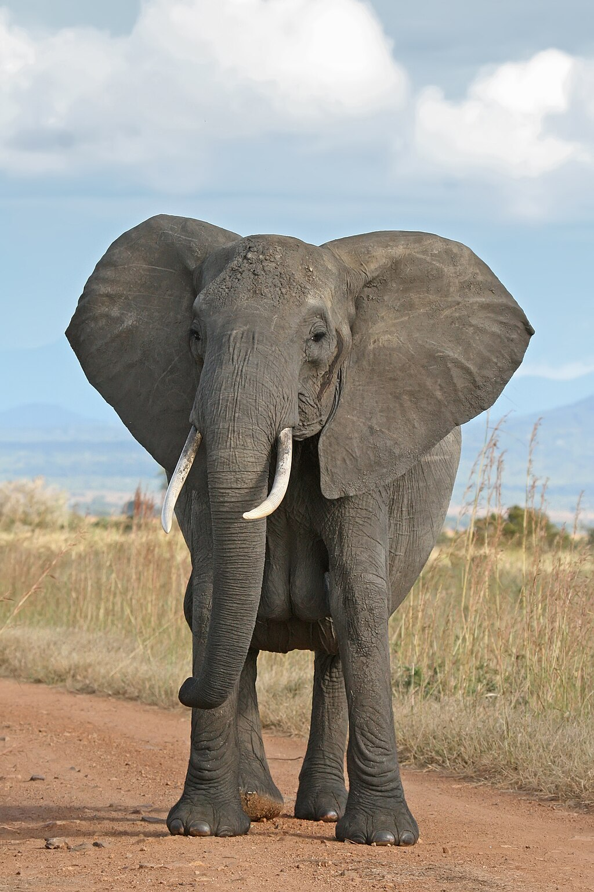

# Elephant

Elephants are the largest existing land animals. Three species are currently recognized: the African bush elephant, the African forest elephant, and the Asian elephant. They are an informal grouping within the family Elephantidae of the order Proboscidea. Elephantidae is the only surviving family of the order Proboscidea; other, now extinct, members of the order include deinotheres, gomphotheres, mammoths, and mastodons. Elephants have a trunk, which is a fusion of their nose and upper lip, and they use it for communication and handling objects. Their incisors grow into tusks, which can serve as weapons and tools for moving objects and digging. The large ear flaps of the African elephants help to control their body temperature. African elephants have larger ears and concave backs, whereas Asian elephants have smaller ears and convex or level backs.

Elephants are scattered throughout sub-Saharan Africa, South Asia, and Southeast Asia and are found in different habitats, including savannahs, forests, deserts, and marshes. They are herbivorous and stay near water when it is accessible. They are considered to be keystone species due to their impact on their environments. Elephants live in herds led by a matriarch; they have a fission–fusion society in which multiple family groups come together to socialize. Males leave their family groups when they reach puberty and may live alone or with other males.

*Source: [Wikipedia](https://en.wikipedia.org/wiki/Elephant)*
