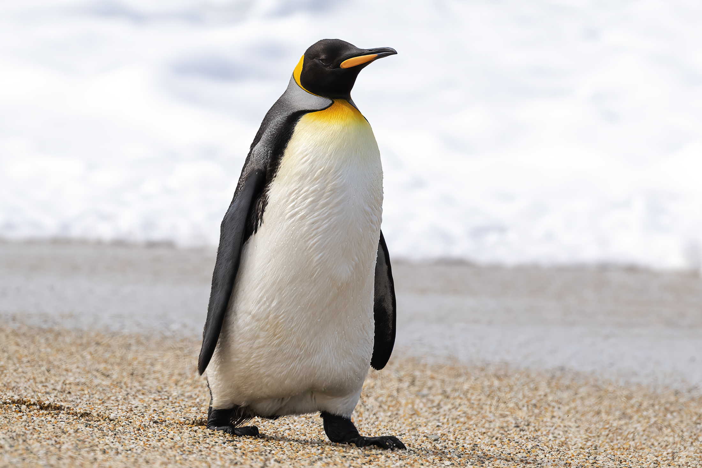

# Penguin

Penguins are a group of aquatic, flightless birds. They live almost exclusively in the Southern Hemisphere, with only one species, the Galápagos penguin, found north of the equator. Highly adapted for life in the water, penguins have countershaded dark and white plumage and flippers for swimming. Most penguins feed on krill, fish, squid, and other forms of sea life caught while swimming underwater. They spend roughly half of their lives on land and the other half in the sea.

The largest living species is the emperor penguin (Aptenodytes forsteri): on average, adults are about 1.1 m (3 ft 7 in) tall and weigh 35 kg (77 lb). The smallest penguin species is the little blue penguin (Eudyptula minor), also known as the fairy penguin, which stands around 40 cm (16 in) tall and weighs 1 kg (2.2 lb). Among extant penguins, larger penguins inhabit colder regions, while smaller penguins are generally found in temperate or even tropical climates. Some prehistoric species attained enormous sizes, becoming as tall or as heavy as an adult human.

*Source: [Wikipedia](https://en.wikipedia.org/wiki/Penguin)*
